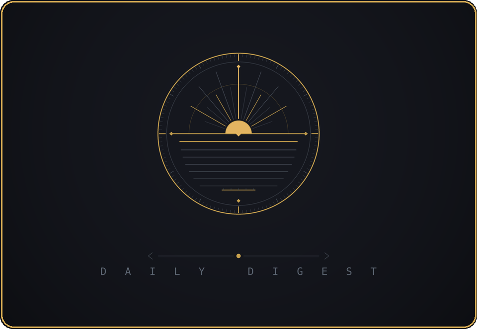
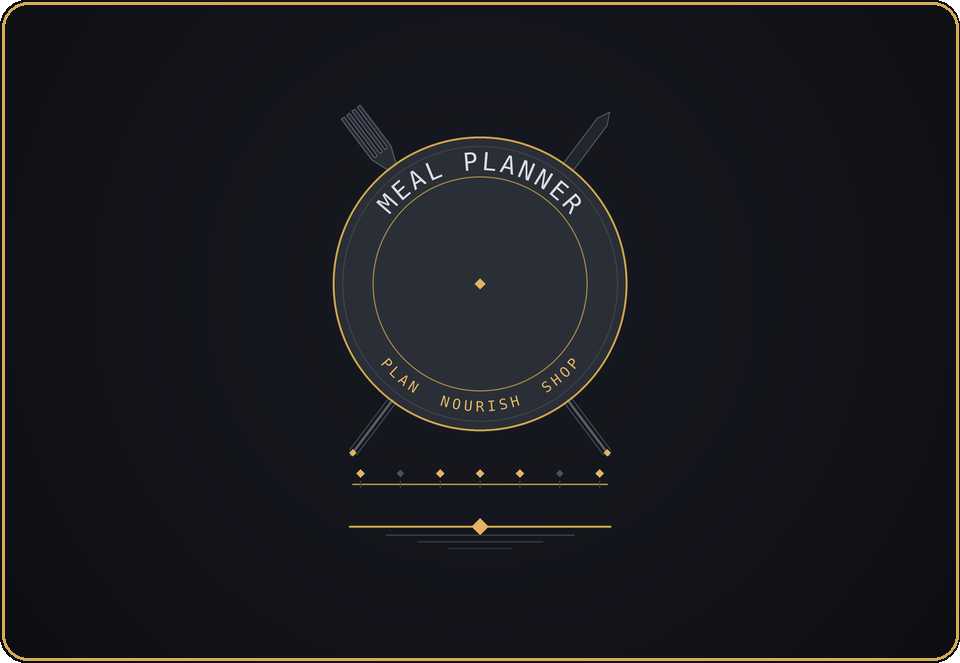
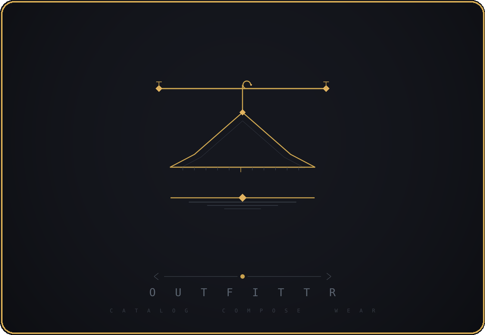
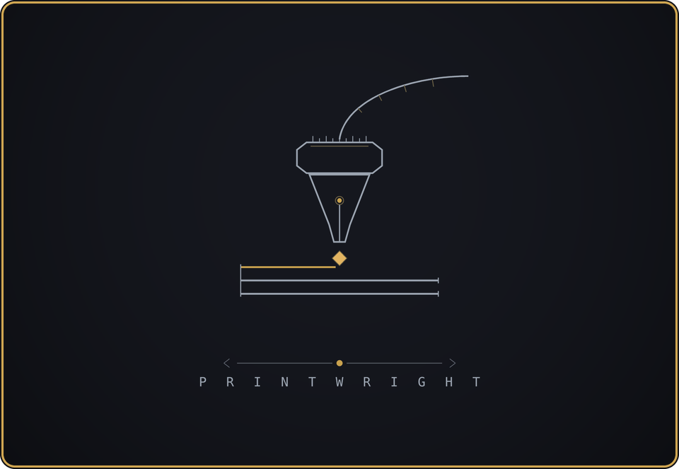

<!-- Heuralux — organization profile. Identity: Concept 3, "Luminant Order" /
     Horizon Compass mark. See heuralux/design-official for the design system. -->

 

<b>HEURISKO</b> · to discover&nbsp;&nbsp;&nbsp;&nbsp;|&nbsp;&nbsp;&nbsp;&nbsp;<b>LUX</b> · light

 

## Welcome to Heuralux

Heuralux provides practical AI, machine-learning, and data tools for the
businesses and people who could use a sharp tool but don't have a software team
on staff. The aim is straightforward: take a real problem and build something
that genuinely helps — without the buzzwords or the AI you don't actually need.

 

## What We Do

We work alongside people who know their field inside and out and turn that
expertise into computational tools that accelerate, simplify, and empower the way they actually work. You bring the
deep knowledge of your business; we bring the modeling and engineering to amplify it. Together we scope the right-sized tool — no more, and no less than the
problem calls for.

That might look like:

- **A model** that forecasts demand, pricing, or inventory from the data you
  already have.
- **An assistant** that handles the repetitive, time-consuming parts of your
  week.
- **A small app or script** that turns hours of manual work into the press of a
  button.
- **A clear assessment** of whether AI is the right fit at all — sometimes it
  isn't, and I'll tell you so.

If you'd like to find out whether something is possible, or simply where to
start, we're glad to talk it through.

 

## Open-source tools

We also develop open-source tools — both to be useful and
to keep exploring what's possible. These are early and still evolving, so treat
them as works in progress rather than finished products.

 

## Background

 

I hold a PhD in Engineering, a Masters in Computational and Information Science, and have spent 15+ years building simulation,
modeling, and machine-learning software for academics, the US federal government, international partners, and private industry — the kind of work that usually lives
inside research labs and engineering teams. Much of that career has been spent
translating cutting edge research into tools and models that solve complex, real-world problems people are facing. Heuralux brings that legacy to a wider audience.

The name reflects the intent: **HEURISKO** — *to discover* — and **LUX** —
*light*. Amid considerable hype and noise around AI, the goal is simply to cut
through it and deliver tools that genuinely help.

 

## Get in touch

If there's a problem you think software might solve, we'd like to hear about it.

**[contact@heuralux.onmicrosoft.com](mailto:contact@heuralux.onmicrosoft.com)**

 

HEURALUX&nbsp;&nbsp;·&nbsp;&nbsp;<i>smart tools for real problems</i>

