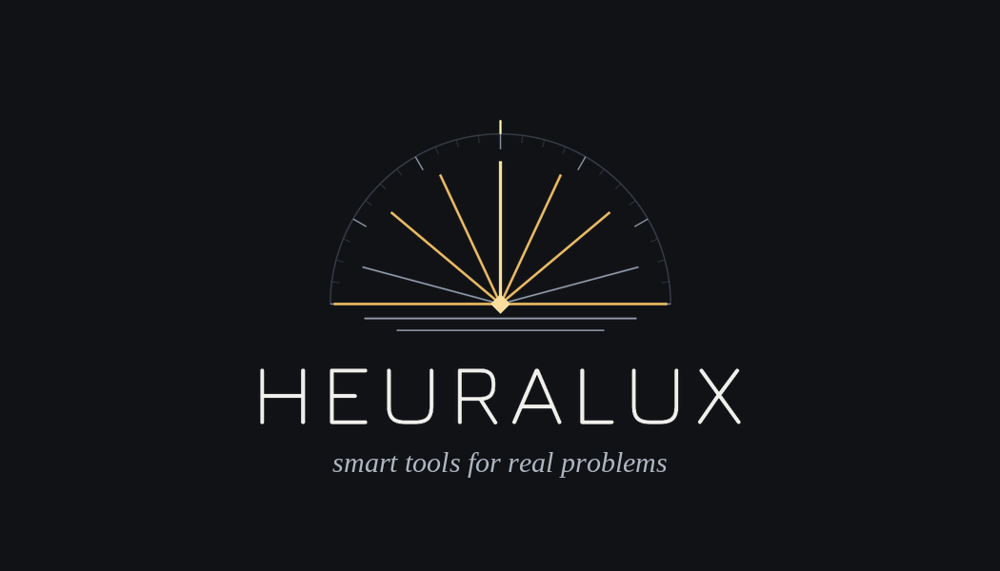
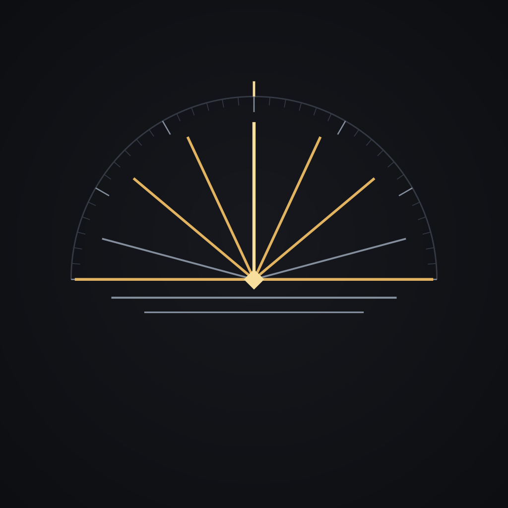

<!-- Heuralux — organization profile. Identity: Concept 3, "Luminant Order" /
     Horizon Compass mark. See heuralux/design-official for the design system. -->

 

<b>HEURISKO</b> · to discover&nbsp;&nbsp;&nbsp;&nbsp;|&nbsp;&nbsp;&nbsp;&nbsp;<b>LUX</b> · light

 

## Curious about AI?

**Wondering how AI could help grow your business? Curious whether it could save
you time and money in your own day-to-day? Trying to work out what's real and
what's just hype?**

We can help.

 

## Who we are

We're **Heuralux**, and we build **smart tools to solve real problems**:
practical, well-made software for people who have things that need to get done.
Our north star is simple — take a dense, opaque problem and resolve it into a
solution a person can understand at a glance and use with confidence. We'd rather
ship one tool that genuinely improves your life than ten that merely add noise and distraction.

The name says the rest: **HEURISKO** — *to discover* — and **LUX** — *light*. The age of AI is full of hype and shadows. We aim to cut through the noise to deliver helpful innovations.

 

## What we believe

These convictions show up in everything we make:

- **Precision over decoration.** Every element earns its place. Nothing is there
  to fill space; each detail is a considered.
- **Craft as a feature.** The care is the product. We sweat the details — the intangibles you feel even when you can't name them.
- **Discovery as navigation.** Good tools don't just address today's needs; they
  give you a bearing on the future.

 

 

## What we make

We build **tools for general use** — easy-to-use, dependable software anyone can
pick up and put to work. We take complex, tedious tasks and make them simpler,
backed by a meticulously crafted design system so everything we ship is a part of a coherent family of products.

The **Horizon Compass** above is our mark: seven bearings rising from a single
horizon point — a book opening into light, a sun cresting a horizon, a compass
taking a heading. Discovery rendered as navigation.

 

## How we can help

Beyond the tools we make for everyone, we work with you directly in three ways.

### Off-the-shelf solutions

Ready-to-use software, built to the same standard as everything we ship:
practical, well-made, and dependable from day one. No setup project required —
just pick it up and get to work.

### 1:1 consulting & design

When an off-the-shelf tool isn't the right fit, we'll sit down with you and
design a **right-sized tool** — no more and no less than the problem calls for.
We build custom solutions that **judiciously put AI to work on real problems** —
not brittle, flashy demos that impress initially and then stall in production,
but systems that earn their place in your daily workflow.

- **Find the high-value use case.** We separate the work AI should do from the
  work it shouldn't, so you invest where it actually pays off.
- **Build it for real.** Custom assistants, agents, and automations wired into
  your tools and data — shipped, measured, and dependable.
- **Make it legible.** We bring discipline to
  AI: clear behavior, honest limits, outputs a person can trust and act on.

### Education & training on AI

We help your team understand AI and use it well — practical, hands-on training
and guidance grounded in real work, not hype. We bring you up to speed on what
the tools can and can't do, and leave you with the guardrails and confidence to
keep going after we're done.

Curious where AI fits in your work? Let's talk.

 

## Get in touch

Have a tough problem that needs a soution? We'd like to hear about it.

**[admin@heuralux.onmicrosoft.com](mailto:admin@heuralux.onmicrosoft.com)**

 

HEURALUX&nbsp;&nbsp;·&nbsp;&nbsp;<i>smart tools for real problems</i>

