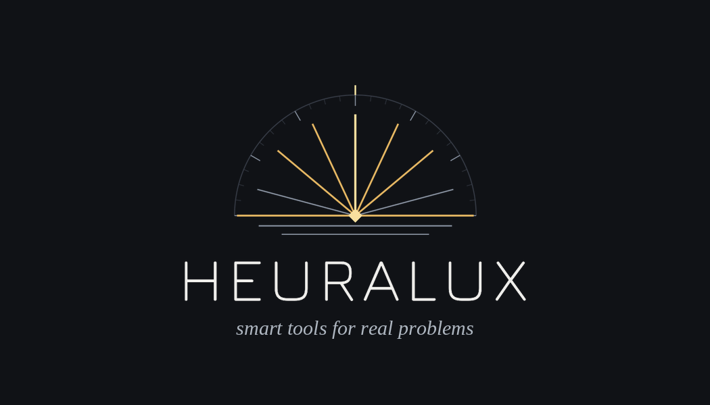
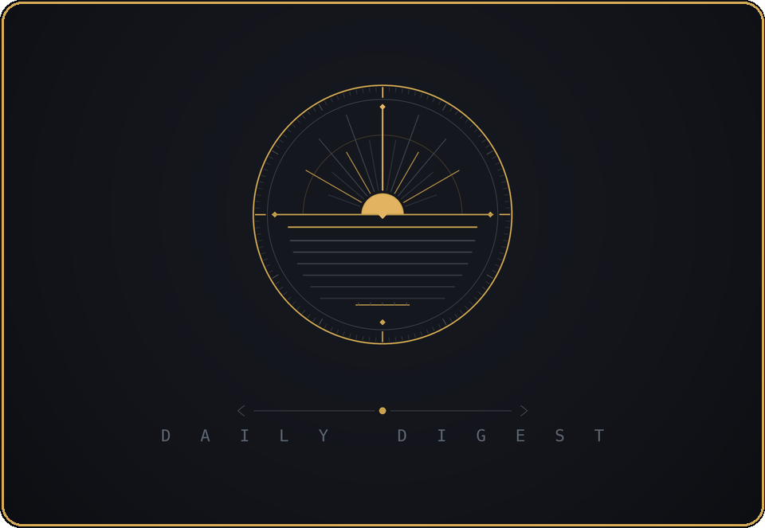
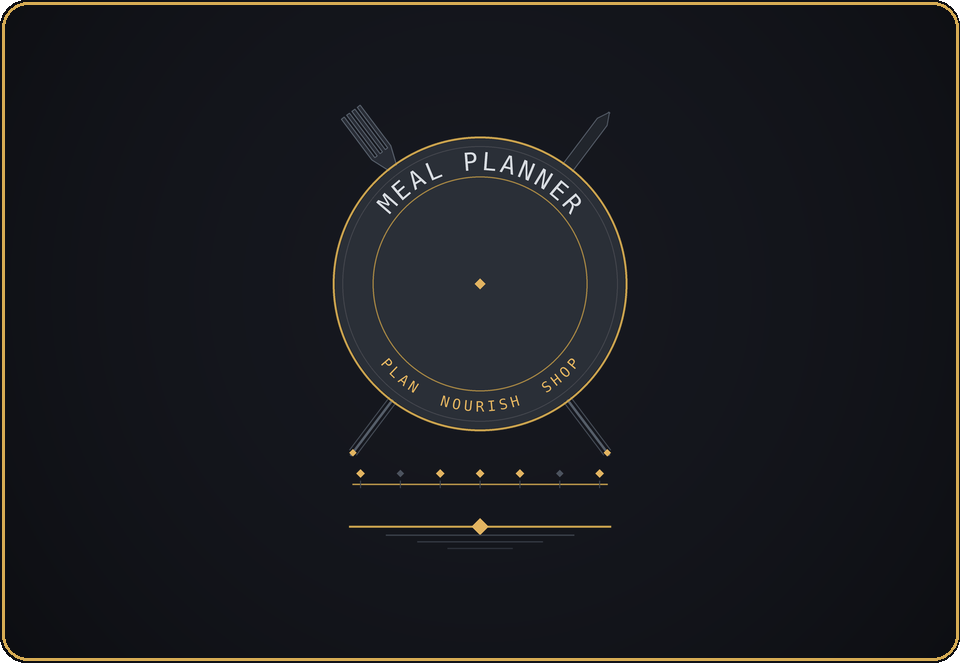
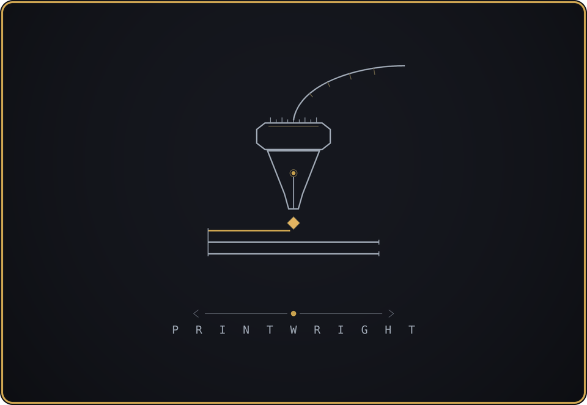
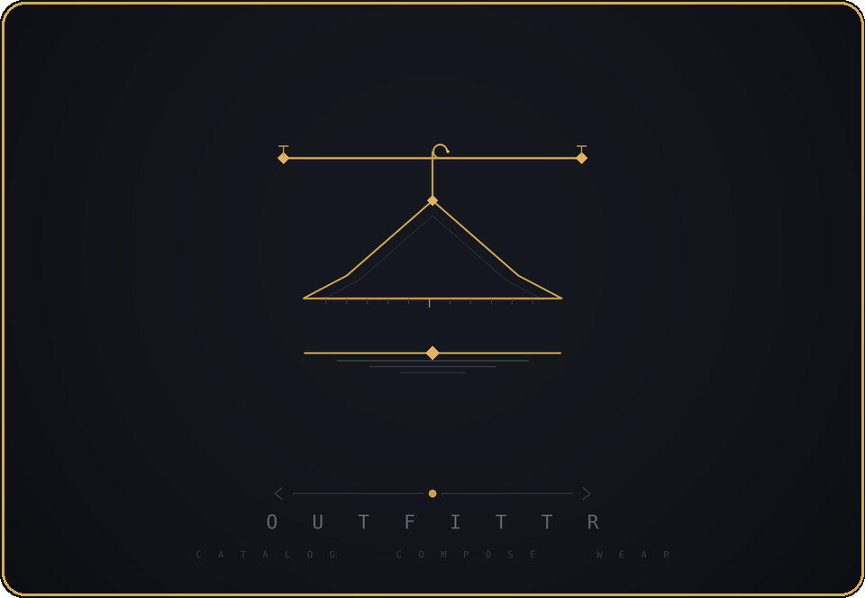
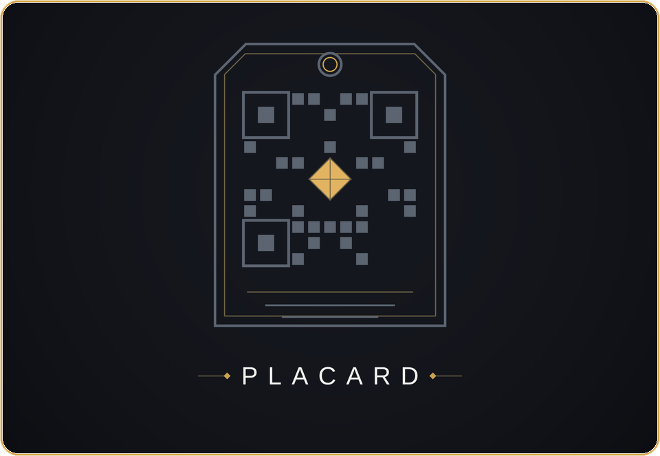
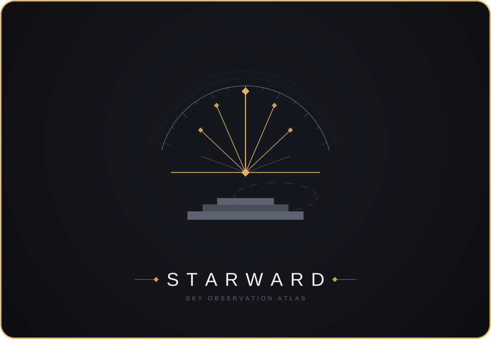
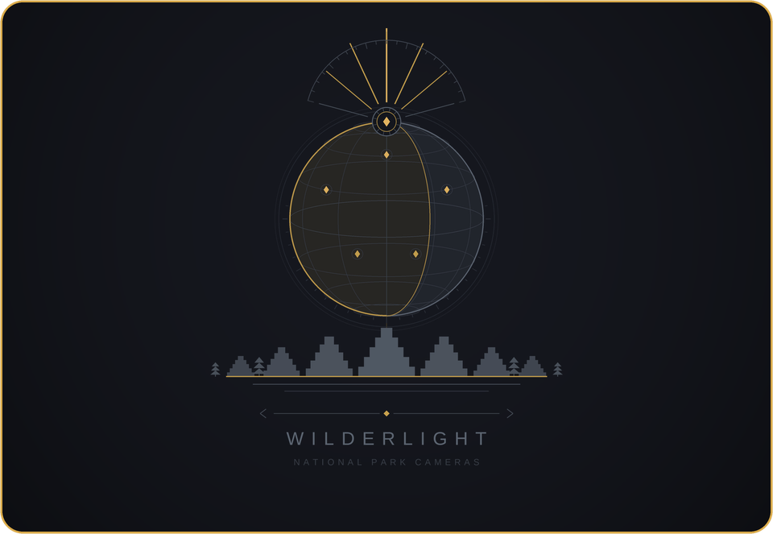
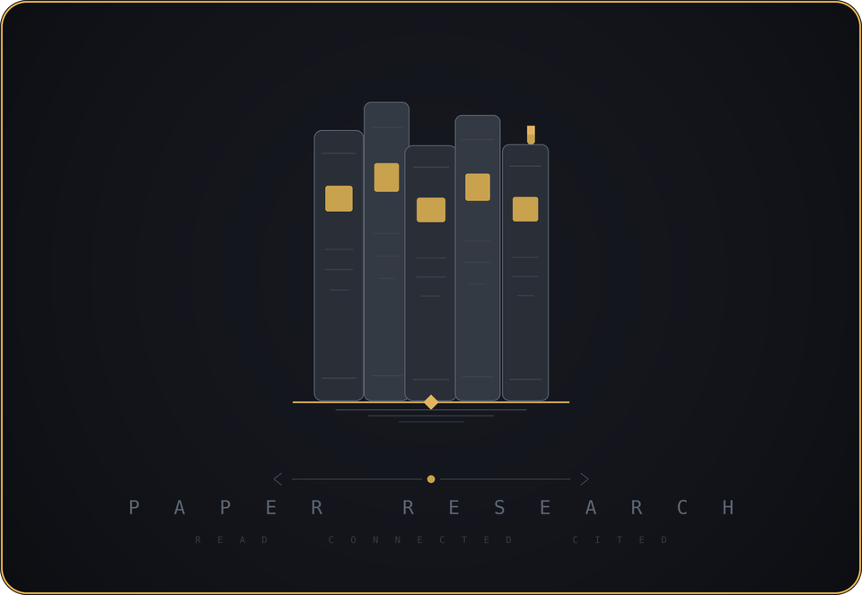
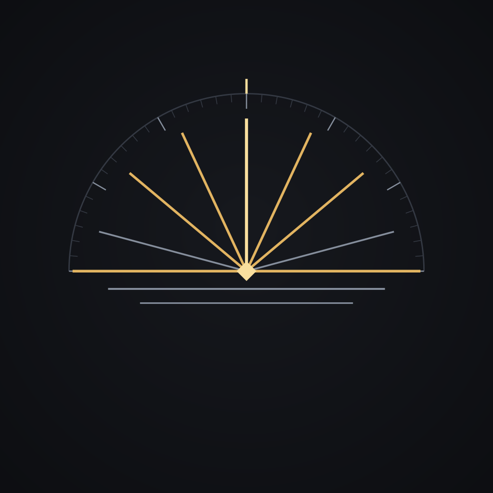

<!-- Heuralux — organization profile. Identity: Concept 3, "Luminant Order" /
     Horizon Compass mark. See heuralux/design-official for the design system. -->

 

<b>HEURISKO</b> · to discover&nbsp;&nbsp;&nbsp;&nbsp;|&nbsp;&nbsp;&nbsp;&nbsp;<b>LUX</b> · light

 

## About

Heuralux is a small, independent project where I build software, AI/ML, and data
tools that are meant to be both useful and interesting. For now it's a hobby:
built in spare time, released in the open, and driven as much by curiosity as by
need. No buzzwords, and no AI for its own sake.

## How things are built

* **Useful first.** Each tool starts from a real, everyday problem, not a
  technology looking for one.
* **Local by default.** Data is generally stored and processed on your own
  device. Calls to frontier LLMs are the main exception, and new cloud services
  are kept to a minimum.
* **Right-sized.** No more complexity than the problem calls for.
* **Honest about maturity.** Everything here is early and evolving. Treat these
  as works in progress, not finished products.

## Projects

### Claude Code plugins

Skills and workflows that run inside Claude Code.

### Home automation

Standalone tools for running things around the house.

### Exploration

Windows onto the sky and the wild.

### Research

Tools for keeping up with, and making sense of, the scientific literature.

## Background

I hold a PhD in Engineering and a Master's in Computational and Information
Science, and have spent 15+ years building simulation, modeling, and
machine-learning software for academia, the US federal government, international
partners, and private industry. Much of that work has been about translating
cutting-edge research into tools that solve complex, real-world problems.
Heuralux is where I apply the same care to smaller, everyday ones.

The name reflects the intent: **HEURISKO** (*to discover*) and **LUX** (*light*).
Amid the hype and noise around AI, the aim is simply to cut through it and make
things that genuinely help.

## Get in touch

Feedback, bug reports, and ideas are welcome. The best place for them is an
issue on the relevant project. For anything else, including collaboration, reach
out at **[contact@heuralux.org](mailto:contact@heuralux.org)**.

 

<!--
Kept for later, if Heuralux takes on client work.

## What We Do

Heuralux works alongside people who know their field inside and out and turns
that expertise into computational tools that accelerate, simplify, and empower
the way they actually work. You bring the deep knowledge of your business; we
bring the modeling and engineering to amplify it. Together we scope the
right-sized tool; no more, and no less than the problem calls for.

That might look like:

* **A model** that forecasts demand, pricing, or inventory from the data you
  already have.
* **An assistant** that handles the repetitive, time-consuming parts of your
  week.
* **A small app or script** that turns hours of manual work into the press of a
  button.
* **A clear assessment** of whether AI is the right fit at all; sometimes it
  isn't, and we'll tell you so.

If you'd like to find out whether something is possible, or simply where to
start, we're glad to talk it through. **[contact@heuralux.org](mailto:contact@heuralux.org)**
-->
